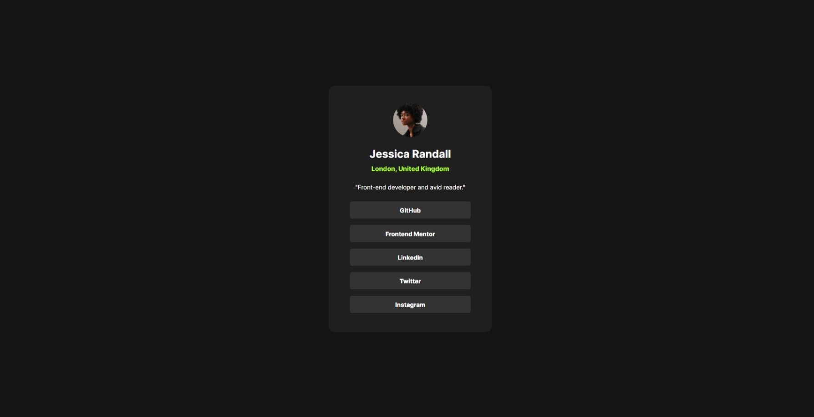

# Frontend Mentor - Social links profile solution

This is a solution to the [Social links profile challenge on Frontend Mentor](https://www.frontendmentor.io/challenges/social-links-profile-UG32l9m6dQ). Frontend Mentor challenges help you improve your coding skills by building realistic projects. 

## Table of contents

- [Overview](#overview)
  - [The challenge](#the-challenge)
  - [Screenshot](#screenshot)
  - [Links](#links)
- [My process](#my-process)
  - [Built with](#built-with)
  - [What I learned](#what-i-learned)
- [Author](#author)

## Overview

### The challenge

Social Link Profile:

- In this small project, you'll build out your social link-sharing profile. You can even personalize it and use it to share all your social profiles!

### Screenshot

 

### Links

- Solution URL: [Add solution URL here](https://your-solution-url.com)
- Live Site URL: [Add live site URL here](https://your-live-site-url.com)

## My process

### Built with

- Semantic HTML5 markup
- CSS custom properties
- Flexbox
- CSS Grid

### What I learned

After a while off I returned to my studies and tried to do it with lists, some difficulties appeared, when accessing the lists internally but researching better, trying to understand where I was going wrong I found what my mistake was, after correcting the project it started to move.

## Author

- Website - [Jonathan WR Silva]
- Frontend Mentor - [@johnslayk](https://www.frontendmentor.io/profile/johnslayk)
- Twitter - [@johnslayk](https://www.twitter.com/johnslayk)

